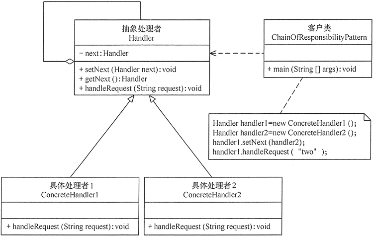

## 责任链模式

责任链模式使多个对象都有机会处理请求，从而避免请求的发送者和接收者之间的耦合关系。将这些对象连成一条链，并沿着这条链传递该请求，直到有一个对象处理它为止。

在现实生活中，常常会出现这样的事例：一个请求有多个对象可以处理，但每个对象的处理条件或权限不同。例如，公司员工请假，可批假的领导有部门负责人、副总经理、总经理等，但每个领导能批准的天数不同，员工必须根据自己要请假的天数去找不同的领导签名，也就是说员工必须记住每个领导的姓名、电话和地址等信息，这增加了难度。这样的例子还有很多，如找领导出差报销、生活中的“击鼓传花”游戏等。 

责任链模式，每个节点实现是否可以相应请求，而命令模式则是在节点之外统一实现这一逻辑。

### 责任链模式类图:

**类图**

责任链模式包含以下主要角色。

1. **抽象处理者（Handler）角色：**

   定义一个处理请求的接口，包含抽象处理方法和一个后继连接。

2. **具体处理者（Concrete Handler）角色：**

   实现抽象处理者的处理方法，判断能否处理本次请求，如果可以处理请求则处理，否则将该请求转给它的后继者。

3. **客户类（Client）角色：**

   创建处理链，并向链头的具体处理者对象提交请求，它不关心处理细节和请求的传递过程。

### 优点

1.  降低了对象之间的耦合度。该模式使得一个对象无须知道到底是哪一个对象处理其请求以及链的结构，发送者和接收者也无须拥有对方的明确信息。
2.  增强了系统的可扩展性。可以根据需要增加新的请求处理类，满足开闭原则。
3.  增强了给对象指派职责的灵活性。当工作流程发生变化，可以动态地改变链内的成员或者调动它们的次序，也可动态地新增或者删除责任。
4.  责任链简化了对象之间的连接。每个对象只需保持一个指向其后继者的引用，不需保持其他所有处理者的引用，这避免了使用众多的 if 或者 if···else 语句。
5.  责任分担。每个类只需要处理自己该处理的工作，不该处理的传递给下一个对象完成，明确各类的责任范围，符合类的单一职责原则。 

### 缺点

1. 不能保证每个请求一定被处理。由于一个请求没有明确的接收者，所以不能保证它一定会被处理，该请求可能一直传到链的末端都得不到处理。
2. 对比较长的责任链，请求的处理可能涉及多个处理对象，系统性能将受到一定影响。
3. 责任链建立的合理性要靠客户端来保证，增加了客户端的复杂性，可能会由于责任链的错误设置而导致系统出错，如可能会造成循环调用。
4.  不易于调试。由于该模式采用了类似递归的方式，调试的时候逻辑比较复杂。 

### 责任链模式实现效果分析：

1. **增强了给对象指派职责(Responsibility)的灵活性**

   当在对象中分派职责时，职责链给你更多的灵活性。你可以通过在运行时刻对该链进行动态的增加或修改来增加或改变处理一个请求的那些职责。你可以将这种机制与静态的特例化处理对象的继承机制结合起来使用。

2. **不保证被接受**

   既然一个请求没有明确的接收者，那么就不能保证它一定会被处理—该请求可能一直到链的末端都得不到处理。一个请求也可能因该链没有被正确配置而得不到处理。

### 使用场景

1.  多个对象可以处理一个请求，哪个对象处理该请求由运行时刻自动确定。
2.  可动态指定一组对象处理请求，或添加新的处理者。
3.  在不明确指定请求处理者的情况下，向多个处理者中的一个提交请求。 

### 代码

略
