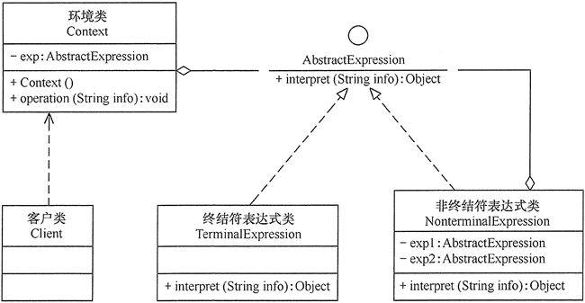

## 解释器模式

给定一个语言，定义它的文法的一种表示，并定义一个解释器，这个解释器使用该表示来解释语言中的句子。

### 解释器模式类图:

**类图**

解释器模式包含以下主要角色。

1. **抽象表达式（Abstract Expression）：**

   定义解释器的接口，约定解释器的解释操作，主要包含解释方法 interpret()。

2. **终结符表达式（Terminal  Expression）：**

   是抽象表达式的子类，用来实现文法中与终结符相关的操作，文法中的每一个终结符都有一个具体终结表达式与之相对应。

3. **非终结符表达式（Nonterminal Expression）：**

   也是抽象表达式的子类，用来实现文法中与非终结符相关的操作，文法中的每条规则都对应于一个非终结符表达式。

4. **环境（Context）：**

   通常包含各个解释器需要的数据或是公共的功能，一般用来传递被所有解释器共享的数据，后面的解释器可以从这里获取这些值。
   

### 优点

1.   语法由很多类表示，容易改变及扩展此"语言"。 
2.   可扩展性比较好，灵活。 
3.  易于实现简单文法。 

### 缺点

1. 当语法规则数目过多时，增加了系统的复杂度。
2. 可利用场景比较少。   
3. 对于复杂的文法比较难维护。 
4. 解释器模式会引起类膨胀。 
5. 解释器模式采用递归调用方法
6. 解释器模式执行效率不高。 

### 解释器模式实现效果分析：

1. **易于改变和扩展文法**

   因为该模式使用类来表示文法规则,你可使用继承来改变或扩展该文法。已有的表达式可被增量式地改变,而新的表达式可定义为旧表达式的变体。

2. **易于实现文法**

   定义抽象语法树中各个节点的类的实现大体类似。这些类易于直接编写，通常它们也可用一个编译器或语法分析程序生成器自动生成。

3. **复杂的文法难以维护**

   解释器模式为文法中的每一条规则至少定义了一个类(使用BNF定义的文法规则需要更多的类)。因此包含许多规则的文法可能难以管理和维护。可应用其他的设计模式来缓解这一问题。但当文法非常复杂时,其他的技术如语法分析程序或编译器生成器更为合适。

4. **增加了新的解释表达式的方式**

   解释器模式使得实现新表达式“计算”变得容易。例如,你可以在表达式类上定义一个新的操作以支持优美打印或表达式的类型检查。如果你经常创建新的解释表达式的方式,那么可以考虑使用Visitor模式以避免修改这些代表文法的类。

### 使用场景

1.  可以将一个需要解释执行的语言中的句子表示为一个抽象语法树。 
2.  一些重复出现的问题可以用一种简单的语言来进行表达。 
3.  一个简单语法需要解释的场景。 

### 代码

略
