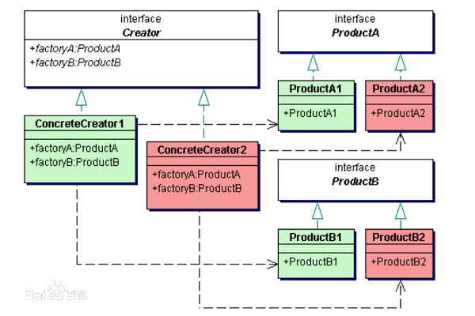

## 抽象工厂模式

提供一个创建一系列相关或相互依赖对象的接口，而无需指定它们具体的类。

抽象工厂模式用于生成产品族的工厂，所生成的对象是有关联的。

如果抽象工厂退化成生成的对象无关联则成为工厂方法模式。

例如：创建属于同一风格的界面组件的工厂。

### 角色及其职责:

**类图**

抽象工厂模式是工厂方法模式的一种扩展，即提供了可生成产品族的工厂，其与工厂方法模式非常相似。

### 优点

1. **分离了具体的类**

   Abstract Factory模式帮助你控制一个应用创建的对象的类。因为一个工厂封装创建产品对象的责任和过程，它将客户与类的实现分离。客户通过它们的抽象接口操纵实例。产品的类名也在具体工厂的实现中被分离；它们不出现在客户代码中。

2. **易于交换产品系列**

   一个具体工厂类在一个应用中仅出现一次—即在它初始化的时候。这使得改变一个应用的具体工厂变得很容易。它只需改变具体的工厂即可使用不同的产品配置，这是因为一个抽象工厂创建了一个完整的产品系列，所以整个产品系列会立刻改变。例如再用户界面中，我们仅需转换到相应的工厂对象并重新创建接口，就可实现从一种风格的窗口组件转换为另一种风格的窗口组件。

3. **有利于产品的一致性**

   当一个系列中的产品对象被设计成一起工作时，一个应用一次只能使用同一个系列中的对象，这一点很重要。而Abstract Factory很容易实现这一点。

### 缺点

**难以支持新种类的产品**

难以扩展抽象工厂以生产新种类的产品。这是因为Abstract Factory接口确定了可以被创建的产品集合。支持新种类的产品就需要扩展该工厂接口，这将涉及Abstract Factory类及其所有子类的改变。

### 使用场景

在以下情况可以使用Abstract Factory模式

1. 一个系统要独立于它的产品的创建、组合和表示时。
2. 一个系统要由多个产品系列中的一个来配置时。
3. 当你要强调一系列相关的产品对象的设计以便进行联合使用时。
4. 当你提供一个产品类库，而只想显示它们的接口而不是实现时。

### 代码

略