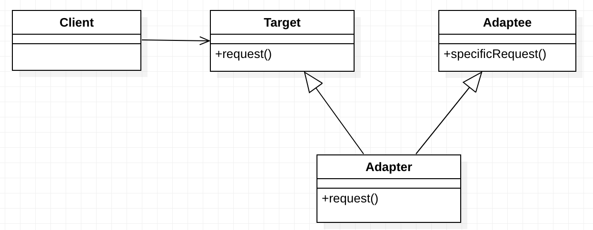
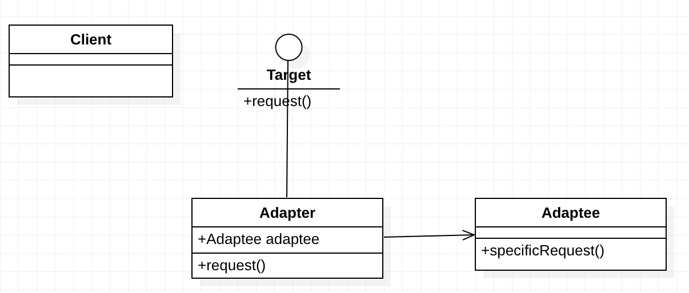

## 适配器模式

适配器模式（Adapter Pattern）是作为两个不兼容的接口之间的桥梁。这种类型的设计模式属于结构型模式，它结合了两个独立接口的功能。适配器模式将一个类的接口适配成用户所期待的。一个适配允许通常因为接口不兼容而不能在一起工作的类工作在一起，做法是将类自己的接口包裹在一个已存在的类中。

### 角色及其职责:

适配器模式根据实现方案的不同，可分为类适配器模式、对象适配器模式和缺省适配器模式。

#### 类适配器

**类图**



由于在很多语言中，不支持多继承，因此这种方式，一般会将Target定义为接口。

Client调用Target的request方法，其实现类Adapter的request方法将提供实现。Adapter的request调用父类adaptee的specificRequest方法，运行真正的业务逻辑，并将结果转换为request函数的返回值返回。

**代码**

首先有一个已存在的将被适配的类

```java
public class Adaptee {
    public void adapteeRequest() {
        System.out.println("被适配者的方法");
    }
}
```

定义一个目标接口

```java
public interface Target {
    void request();
}
```


Target接口实现，为测试做对比 

```java
public class ConcreteTarget implements Target {
    @Override
    public void request() {
        System.out.println("concreteTarget目标方法");
    }
}
```

适配器类，实现 `Target` 接口，同时继承了 `Adaptee` 类，然后在实现的 `request()` 方法中调用父类的 `adapteeRequest()` 即可实现

```java
public class Adapter extends Adaptee implements Target{
    @Override
    public void request() {
        //...一些操作...
        super.adapteeRequest();
        //...一些操作...
    }
}
```

测试

```java
public class Test {
    public static void main(String[] args) {
        Target target = new ConcreteTarget();
        target.request();

        Target adapterTarget = new Adapter();
        adapterTarget.request();
    }
}
```

输出

```java
concreteTarget目标方法
被适配者的方法
```

#### 对象适配器

**类图**



Client调用Target的request方法，其实现类Adapter的request方法将提供实现。Adapter通过聚合，拥有Adaptee的实例，在request方法中调用属性Adaptee的specificRequest方法，运行真正的业务逻辑，并将结果转换为request函数的返回值返回。


**代码**

对象适配器与类适配器不同之处在于，类适配器通过继承来完成适配，对象适配器则是通过聚合，拥有Adaptee的实例完成，这里稍微修改一下 `Adapter` 类即可将转变为对象适配器

```java
public class Adapter implements Target{
    // 适配者是对象适配器的一个属性
    private Adaptee adaptee = new Adaptee();

    @Override
    public void request() {
        //...
        adaptee.adapteeRequest();
        //...
    }
}
```

#### 缺省适配器模式

当不需要全部实现接口提供的方法时，可以设计一个适配器抽象类实现接口，并为接口中的每个方法提供默认方法，抽象类的子类就可以有选择的覆盖父类的某些方法实现需求，它适用于一个接口不想使用所有的方法的情况。

### 优点

1. 将调用方和被适配的类解耦，通过引入一个适配器类来重用现有的适配者类，无须修改原有结构。
2. 增加了类的透明性和复用性，将具体的业务实现过程封装在适配者类中，对于客户端类而言是透明的，而且提高了适配者的复用性，同一个适配者类可以在多个不同的系统中复用。
3. 灵活性和扩展性都非常好，通过使用配置文件，可以很方便地更换适配器，也可以在不修改原有代码的基础上增加新的适配器类，完全符合“开闭原则”。
4. 由于适配器类是通过继承或者聚合整合了适配者类，因此可以在适配器类中扩展一些适配者的方法，使得适配器的灵活性更强。
5. 一个对象适配器可以把多个不同的适配者适配到同一个目标；

### 缺点

使用适配器模式，增加了系统调用的层次，提高了系统的复杂度，如果不是在程序结构甚至是系统架构上具备合理性，应尽量减少适配器模式的使用。

### 使用场景

- 系统需要使用一些现有的类，而这些类的接口（如方法名）不符合系统的需要，甚至没有这些类的源代码。
- 想创建一个可以重复使用的类，用于与一些彼此之间没有太大关联的一些类，包括一些可能在将来引进的类一起工作。

