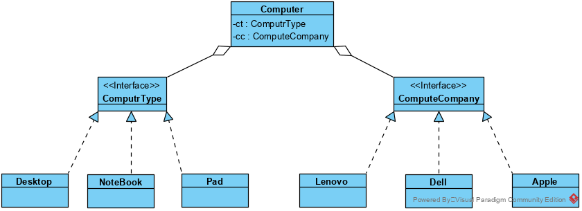

## 桥接模式

桥接（Bridge）是用于把抽象化与实现化解耦，使得二者可以独立变化。这种类型的设计模式属于结构型模式，它通过提供抽象化和实现化之间的桥接结构，来实现二者的解耦。

当一个抽象可能有多个实现时，通常用继承来协调它们。抽象类定义对该抽象的接口，而具体的子类则用不同方式加以实现。但是此方法有时不够灵活。继承机制将抽象部分与它的实现部分固定在一起，使得难以对抽象部分和实现部分独立地进行修改、扩充和重用。

https://www.cnblogs.com/shun-gege/p/7514289.html

### 桥接模式类结构:

**类图**

如上图，两个体系ComputerType和ComputerCompany是已经实现的两个体系。如果需要整合两个体系，需要用到多继承【在不支持多继承的环境，需要重写大量重复的代码】，进而产生大量的类。【静态实现】

采用桥接模式，Computer持有ComputerType和ComputerCompany的实例，动态实现两个体系整合。

同时，桥接模式也可以让Type和Company两个体系的实现，与Computer解耦；

Type和Company也可实现解耦，进而可实现更加独立的演变和扩展过程；

桥接模式用组合/聚合代替继承，实现了抽象化与实现化解耦，即在这种情况下，如果采用继承，则抽象部分和实现部分难以分割清楚，而桥接模式可以清晰的界定抽象部分和实现部分。

### 优点

1. 抽象和实现的分离。
2. 优秀的(动态)扩展能力。 
3. 各个维度可独立扩展，互相直接不受影响。																																																				

### 缺点

桥接模式的引入会增加系统的理解与设计难度：

1. 由于聚合关联关系建立在抽象层，要求开发者针对抽象进行设计与编程。
2. 用组合/聚合代替继承，比继承更加灵活机动的特性，也同时意味着更加多的复杂性。

### 使用场景

1. 如果一个系统需要在构件的抽象化角色和具体化角色之间增加更多的灵活性，避免在两个层次之间建立静态的继承联系，通过桥接模式可以使它们在抽象层建立一个关联关系。 
2. 对于那些不希望使用继承或因为多层次继承导致系统类的个数急剧增加的系统，桥接模式尤为适用。 
3. 一个类存在多个独立变化的维度，且这多个维度都需要进行扩展。

### 代码

略