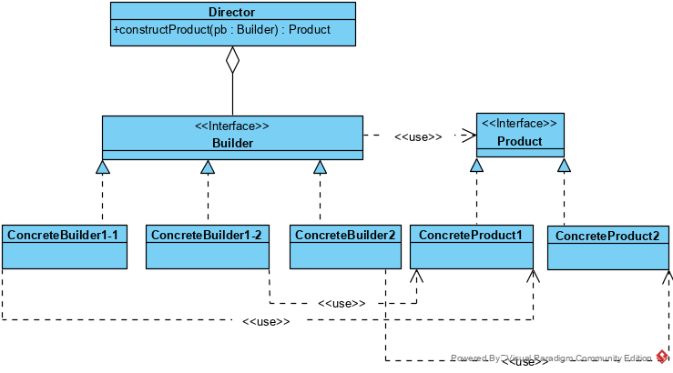

## 建造者模式

建造者模式，将一个复杂对象的构建与它的表示分离，使得同样的构建过程可以创建不同的表示。

### 角色及其职责:

**类图**




建造者模式中，有以下几个角色：

1 **builder：**为创建一个产品对象的各个部件指定抽象接口。

2 **ConcreteBuilder：**实现Builder的接口以创建并初始化具体产品，并以接口形式返回对应产品的。其与具体产品可一一对应，如ConcreteBuilder2与ConcreteProduct2，这种情况主要是将对象复杂的、易变的初始化逻辑与该对象的定义部分分开；多个ConcreteBuilder也可对应一个具体产品，如ConcreteBuilder1-1和ConcreteBuilder1-2，这种情况主要是应对构建同一个对象时，可能有多种复杂的、易变的初始化逻辑。

3 **Director：**构造一个使用Builder接口的对象，通过builder接口，组装Product。builder实现Product的各个部分的构造，Director实现组装。Director在一些情况下可以省略。

4 **Product：**表示被构造的复杂对象。ConcreteBuilder创建该产品的内部表示并定义它的装配过程，包含定义组成部件的类，包括将这些部件装配成最终产品的接口。

### 建造者模式分析

建造者模式实现效果分析：

1. **可以方便的改变一个产品的内部表示**

   Builder对象提供给Director一个构造产品的抽象接口。该接口使得生成器可以隐藏这个产品的表示和内部结构，同时也隐藏了该产品是如何装配的。因为产品是通过抽象接口构造的，在改变该产品的内部表示时所要做的只是定义一个新的生成器。

2. **将构造代码和表示代码分开**

   Builder模式通过封装一个复杂对象的创建和表示方式提高了对象的模块性。客户不需要知道定义产品内部结构的类的所有信息；这些类是不出现在Builder接口中的。每个ConcreteBuilder包含了创建和装配一个特定产品的所有代码。这些代码只需要写一次；然后不同的Director可以复用它以在相同部件集合的基础上构作不同的Product。

3. **使你可对构造过程进行更精细的控制**

   Builder模式与一下子就生成产品的创建型模式不同，它是在Director的控制下一步一步构造产品的。仅当该产品完成时导向者才从生成器中取回它。因此Builder接口相比其他创建型模式能更好的反映产品的构造过程。这使你可以更精细的控制构建过程，从而能更精细的控制所得产品的内部结构。

### 使用场景

1 当创建复杂对象的算法应该独立于该对象的组成部分以及它们的装配方式时。

2 当构造过程必须允许被构造的对象有不同表示时。？？

### 代码

#### Product

定义了产品接口和对应的两款具体产品

```golang
//Product 产品的接口定义
type Product interface {
	setWeight(weight int32) error
	setVolumn(volumn float32) error
	setName(name string) error
	GetName() string
	String() string
}

//具体产品的抽象类
type concreteProduct struct {
	weight int32
	volumn float32
	name   string
}

//ConcreteProduct1 第一类产品的实现类
type ConcreteProduct1 struct {
	concreteProduct
}

//ConcreteProduct2 第二类产品的实现类
type ConcreteProduct2 struct {
	concreteProduct
	surname string
}

func (cp *ConcreteProduct1) setWeight(weight int32) error {
	cp.weight = weight
	return nil
}
func (cp *ConcreteProduct1) setVolumn(volumn float32) error {
	cp.volumn = volumn
	return nil
}
func (cp *ConcreteProduct1) setName(Name string) error {
	cp.name = Name
	return nil
}

//GetName 获取产品名称
func (cp *ConcreteProduct1) GetName() string {

	return cp.name
}
func (cp *ConcreteProduct1) String() string {
	return fmt.Sprintf("name:%s;  weight:%d; volumn:%f;", cp.name, cp.weight, cp.volumn)
}

func (cp *ConcreteProduct2) setWeight(weight int32) error {
	if weight > 100 {
		return errors.New("product is too heavy")
	}
	cp.weight = weight
	return nil
}
func (cp *ConcreteProduct2) setVolumn(volumn float32) error {
	if volumn > 100 {
		return errors.New("product is too big")
	}
	cp.volumn = volumn
	return nil
}
func (cp *ConcreteProduct2) setName(Name string) error {

	cp.name = Name
	return nil
}

//GetName 获取产品名称
func (cp *ConcreteProduct2) GetName() string {
	return cp.name
}
func (cp *ConcreteProduct2) String() string {
	return fmt.Sprintf("name:%s; surname:%s;  weight:%d; volumn:%f;", cp.name, cp.surname, cp.weight, cp.volumn)
}

```

#### builder

定义了建造器接口及三个具体建造器

```golang

//Builder 建造器的接口定义
type Builder interface {
	BuildPart1(weight int32, volunm float32) error
	BuildPart2(name string) error
	BuildPart3() error
	GetProduct() Product
	Init()
}

//具体建造器的抽象结构[类]
type concreteBuilder struct {
	name    string
	product Product
}

func (cb *concreteBuilder) checkProduct() (err error) {
	if cb.product == nil {
		return errors.New("not run init\n")
	}
	return
}

type concreteBuilder1 struct {
	concreteBuilder
}

//ConcreteBuilder11 具体建造器的实现1-1
type ConcreteBuilder11 struct {
	concreteBuilder1
}

//ConcreteBuilder12 具体建造器的实现1-2
type ConcreteBuilder12 struct {
	concreteBuilder1
}

//ConcreteBuilder2 具体建造器的实现2
type ConcreteBuilder2 struct {
	concreteBuilder
}

func (cb *concreteBuilder1) Init() {
	cb.name = "test_name"
	cb.product = &ConcreteProduct1{}
	//fmt.Printf("address %p", &cb)
}
func (cb *concreteBuilder) GetProduct() Product {
	return cb.product
}
func (cb *ConcreteBuilder11) BuildPart1(weight int32, volumn float32) (err error) {
	if err = cb.checkProduct(); err != nil {
		return
	}
	// if cb.product == nil {
	// 	return errors.New("not run init\n")
	// }
	cb.product.setWeight(weight)
	cb.product.setVolumn(volumn)
	return
}

func (cb *ConcreteBuilder11) BuildPart2(name string) (err error) {
	if err = cb.checkProduct(); err != nil {
		return
	}
	cb.product.setName(name)
	return
}

func (cb *ConcreteBuilder11) BuildPart3() (err error) {
	if err = cb.checkProduct(); err != nil {
		return
	}
	name := cb.product.GetName()
	cb.product.setName(name + name)
	return
}

func (cb *ConcreteBuilder12) BuildPart1(weight int32, volumn float32) (err error) {
	if err = cb.checkProduct(); err != nil {
		return
	}
	cb.product.setWeight(weight + weight)
	cb.product.setVolumn(volumn + volumn)
	return
}

func (cb *ConcreteBuilder12) BuildPart2(name string) (err error) {
	if err = cb.checkProduct(); err != nil {
		return
	}
	cb.product.setName(name + " ConcreteBuilder12")
	return
}

func (cb *ConcreteBuilder12) BuildPart3() (err error) {
	if err = cb.checkProduct(); err != nil {
		return
	}
	name := cb.product.GetName()
	cb.product.setName(name + name)
	return
}

func (cb *ConcreteBuilder2) Init() {
	cb.name = "test_name"
	cb.product = &ConcreteProduct2{}
	//fmt.Printf("address %p", &cb)
}

func (cb *ConcreteBuilder2) BuildPart1(weight int32, volumn float32) (err error) {
	if err = cb.checkProduct(); err != nil {
		return
	}
	if err = cb.product.setWeight(weight + weight); err != nil {
		return
	}
	if err = cb.product.setVolumn(volumn + volumn); err != nil {
		return
	}
	return
}

func (cb *ConcreteBuilder2) BuildPart2(name string) (err error) {
	if err = cb.checkProduct(); err != nil {
		return
	}
	cb.product.setName(name + " ConcreteBuilder2")
	cp, ok := cb.product.(*ConcreteProduct2)
	if ok == false {
		err = errors.New("error to convert product to product2")
		return
	}
	cp.surname = " ConcreteBuilder2"
	return
}

func (cb *ConcreteBuilder2) BuildPart3() (err error) {
	if err = cb.checkProduct(); err != nil {
		return
	}
	name := cb.product.GetName()
	cb.product.setName(name + name)
	return
}

```

#### Director

定义了构建器和两个构建方法。其中一个不包含part3的构建

```golang
type Director struct {
}

func (d Director) constructProductbyAllParts(b Builder, w int32, v float32, n string) (Product, error) {
	b.Init()
	if err := b.BuildPart1(w, v); err != nil {
		return nil, err
	}
	//"test constructProductbyAllParts"
	if err := b.BuildPart2(n); err != nil {
		return nil, err
	}
	if err := b.BuildPart3(); err != nil {
		return nil, err
	}

	return b.GetProduct(), nil
}

func (d Director) constructProduct(b Builder) (Product, error) {
	b.Init()
	if err := b.BuildPart1(100, 100.0); err != nil {
		return nil, err
	}
	if err := b.BuildPart2("test constructProduct"); err != nil {
		return nil, err
	}

	return b.GetProduct(), nil
}

```

测试代码

```code
package builder

import "testing"

var p11StrResult string = "name:test constructProductbyAllPartstest " +
	"constructProductbyAllParts;  weight:100; volumn:100.000000;"
var p12StrResult string = "name:test constructProductbyAllParts ConcreteBuilder12test " +
	"constructProductbyAllParts ConcreteBuilder12;  weight:200; volumn:200.000000;"
var p2StrResult string = "name:constructProductbyAllParts ConcreteBuilder2constructProductbyAllParts " +
	"ConcreteBuilder2; surname: ConcreteBuilder2;  weight:100; volumn:90.000000;"
var p21StrResult string = "name:constructProduct ConcreteBuilder2; surname: ConcreteBuilder2;" +
	"  weight:100; volumn:90.000000;"

func testRun(b Builder) (Product, error) {
	d := Director{}
	p, err := d.constructProductbyAllParts(b, 100, 100.0, "constructProductbyAllParts")
	if err != nil {
		return nil, err
	}

	return p, nil
}

//实例化Builder11，可成功builder出产品product1
func TestConstructProductbyAllPartsProduct11(t *testing.T) {
	var b Builder
	b = &ConcreteBuilder11{}

	p, err := testRun(b)
	if err != nil {
		t.Fatalf("builder 11 fail,error is : %s", err)
	}
	pStr := p.String()
	if pStr != p11StrResult {
		t.Fatalf("builder 11 fail,result is : %s", pStr)
	}

}

//实例化Builder12，可成功builder出产品product1，但逻辑略有不同，Builder12中对初始化product1的参数进行了运算处理。
func TestConstructProductbyAllPartsProduct12(t *testing.T) {
	var b Builder
	b = &ConcreteBuilder12{}
	p, err := testRun(b)
	if err != nil {
		t.Fatalf("builder 12 fail,error is : %s", err)
	}
	pStr := p.String()
	if pStr != p12StrResult {
		t.Fatalf("builder 12 fail,result is : %s", pStr)
	}
}

//实例化Builder2，对应的，在build产品product2时，有不同的逻辑，因此不能成功build出product2，
//与Builder12相比，对参数的处理，builder12由builder实现，而build2将一部分逻辑封装到了product2中。
//在实际中采用哪一种方式，需具体分析
func TestConstructProductbyAllPartsProduct21(t *testing.T) {
	var b Builder
	b = &ConcreteBuilder2{}
	p, err := testRun(b)
	if err != nil {
		t.Fatalf("builder 2 fail,error is : %s", err)
	}
	pStr := p.String()
	if pStr != p2StrResult {
		t.Fatalf("builder 2 fail,result is : %s", pStr)
	}
}

//实例化Builder2，可成功builder出产品product2
func TestConstructProductbyAllPartsProduct22(t *testing.T) {
	var b Builder
	b = &ConcreteBuilder2{}
	d := Director{}
	p, err := d.constructProductbyAllParts(b, 50, 45.0, "constructProductbyAllParts")
	if err != nil {
		t.Fatalf("builder 2 fail,error is : %s", err)
	}
	pStr := p.String()
	if pStr != p2StrResult {
		t.Fatalf("builder 2 fail,result is : %s", pStr)
	}
}

//实例化Builder2，可成功builder出产品product2，构建时未构建part3
func TestConstructProductProduct2(t *testing.T) {
	var b Builder
	b = &ConcreteBuilder2{}
	d := Director{}
	p, err := d.constructProduct(b, 50, 45.0, "constructProduct")
	if err != nil {
		t.Fatalf("builder 2 fail,error is : %s", err)
	}
	pStr := p.String()
	if pStr != p21StrResult {
		t.Fatalf("builder 2 fail,result is : %s", pStr)
	}
}

```


#### 代码说明

builder11和builder12都会建造product1产品，两个builder不同点在于：builder11只是简单的赋值，而builder12模拟了一些额外的逻辑，即对参数进行了“+”操作。

builder2则会建造product2产品。

product1相对简单，product2在product1的基础上，增加了对weight和volumn取值范围的限定。

在实现过程中，builder和product都有对产品属性的一些初始化逻辑实现，具体的实现方案，可针对实际情况分析后决定。

Director实现了组装逻辑，一个函数实现了全组装，而另一个则忽略part3的组装。

以上builder设计模式的代码编写完成后，使用就非常简单灵活，可参考测试代码。

测试代码中，偷懒未比较product，仅比较了String的结果。