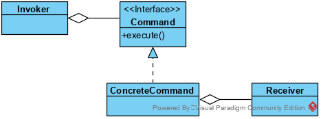

## 命令模式

在软件系统中，“**行为请求者**”与“**行为实现者**”通常呈现一种“**紧耦合**”。但在某些场合，比如要对行为进行“记录、撤销/重做、事务”等处理，这种无法抵御变化的紧耦合是不合适的。在这种情况下，如何将“行为请求者”与“行为实现者”解耦？将**一个请求封装为对象**，**实现二者之间的松耦合**。这就是**命令模式（Command Pattern）。**

显然这样做的好处是符合封装的特性，降低耦合度，Command是将行为进行封装的典型模式，Factory是将创建进行封装的模式。 

Command模式实际上不是个很具体，规定很多的模式， 其实现方式也没有标准模板。 

不少Command模式的代码都是针对图形界面的，它实际就是菜单命令，我们在一个下拉菜单选择一个命令时，然后会执行一些动作。

具体的Command模式代码各式各样，因为如何封装命令，实现请求与命令的匹配，根据需求，有不同的做法。 

### 命令模式类结构:

**类图**

**Command：**

定义命令的接口，声明执行的方法。

**ConcreteCommand：**

命令接口实现对象，是“虚”的实现；通常会持有接收者，并调用接收者的功能来完成命令要执行的操作。

**Receiver：**

接收者，真正执行命令的对象。任何类都可能成为一个接收者，只要它能够实现命令要求实现的相应功能。

**Invoker：**

要求命令对象执行请求，通常会持有命令对象，可以持有很多的命令对象。这个是客户端真正触发命令并要求命令执行相应操作的地方，也就是说相当于使用命令对象的入口。

Receiver的存在，实现了业务代码和实现命令模式的代码的解耦；如果业务代码较简单，也可以整合到ConcreteCommand中。

对于命令模式，如果仅实现少量的确定的命令调用关系，其发挥的作用有限，但对于大量的、易变的命令调用关系，则效果明显。命令调用关系即为请求与命令之间的对应关系。

典型应用：界面GUI和功能实现代码。用户通过操作界面，发起一个功能调用，Invoker则根据GUI的调用，找到对应的Command，进而通过Receiver运行相应的功能代码。在这个过程当中，界面GUI与实际的Command和Receiver实现了解耦，二者之间通过Invoker建立联系，使整个系统更加灵活，更加具备扩展性。

X2ts RPC和Router都采用了命令模式。

Router：

Router相当于Invoker，而Action则相当于Command。

Router实现了Request和Action的路由。

RPC Client将请求封装为Message，通过队列发送给RPC Server执行，在更大范围应用了命令模式。

### 优点

1) 降低系统的耦合度:Command模式将调用操作的对象与知道如何实现该操作的对象解耦。

2) 组合命令:你可将多个命令装配成一个组合命令，即可以比较容易地设计一个命令队列和宏命令。一般说来，组合命令是Composite模式的一个实例。

3) 增加新的Command很容易，因为这无需改变已有的类。

4）可以方便地实现对请求的Undo和Redo。

​																																																				

### 缺点

 使用命令模式可能会导致某些系统有过多的具体命令类。因为针对每一个命令都需要设计一个具体命令类，因此某些系统可能需要大量具体命令类，这将影响命令模式的使用 。

### 使用场景

1）系统需要将请求调用者和请求接收者解耦，使得调用者和接收者不直接交互。

2）系统需要在不同的时间指定请求、将请求排队和执行请求。

3）系统需要支持命令的撤销(Undo)操作和恢复(Redo)操作。

4）系统需要将一组操作组合在一起，即支持宏命令。

### 代码

略

