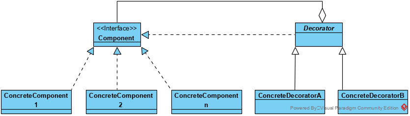

## 装饰器模式

装饰模式指的是在不必改变原类文件和使用继承的情况下，动态地扩展一个对象的功能。它是通过创建一个包装对象，也就是装饰来包裹真实的对象。

装饰者可以在所委拖被装饰者的行为之前或之后加上自己的行为，已达到特定的目的。

装饰器模式利用组合来实现动态类功能的扩展，比较于继承的静态功能扩展，装饰器模式更加灵活。

### 特点

（1） 装饰对象和真实对象有相同的接口。这样客户端对象就能以和真实对象相同的方式和装饰对象交互。

（2） 装饰对象包含一个真实对象的引用（reference）

（3） 装饰对象接受所有来自客户端的请求。它把这些请求转发给真实的对象。

（4） 装饰对象可以在转发这些请求以前或以后增加一些附加功能。这样就确保了在运行时，不用修改给定对象的结构就可以在外部增加附加的功能。在面向对象的设计中，通常是通过继承来实现对给定类的功能扩展。

### 装饰器模式类结构:

**类图**

装饰器模式适合对一系列的Component的实现类进行装饰，如果对于component仅有一个实现类，则完全可以通过继承实现功能的扩展。

另一个维度，对于有较多的，动态变化的，组合的装饰需求，装饰器模式也是比继承更好的选择。

### 优点

1. Decorator模式与继承关系的目的都是要扩展对象的功能，但是Decorator可以提供比继承更多的灵活性。

2. 通过使用不同的具体装饰类以及这些装饰类的排列组合，设计师可以创造出很多不同行为的组合。																																																				

### 缺点

1. 这种比继承更加灵活机动的特性，也同时意味着更加多的复杂性。

2. 装饰模式会导致设计中出现许多小类，如果过度使用，会使程序变得很复杂。

3. 装饰模式是针对抽象组件（Component）类型编程。但是，如果你要针对具体组件编程时，就应该重新思考你的应用架构，以及装饰者是否合适。当然也可以改变Component接口，增加新的公开的行为，实现“半透明”的装饰者模式。在实际项目中要做出最佳选择。

### 使用场景

1. 需要扩展一个类的功能，或给一个类添加附加职责。

2. 需要动态的给一个对象添加功能，这些功能可以再动态的撤销。

3. 需要增加由一些基本功能的排列组合而产生的非常大量的功能，从而使继承关系变得不现实。

4. 当不能采用生成子类的方法进行扩充时。一种情况是，可能有大量独立的扩展，为支持每一种组合将产生大量的子类，使得子类数目呈爆炸性增长。另一种情况可能是因为类定义被隐藏，或类定义不能用于生成子类。

### 代码

略

