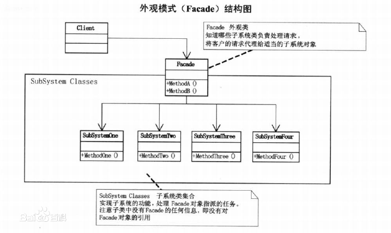

## 外观模式

外观模式（Facade Pattern）隐藏系统的复杂性，并向客户端提供了一个客户端可以访问系统的接口。这种类型的设计模式属于结构型模式，它向现有的系统添加一个接口，来隐藏系统的复杂性。

这种模式涉及到一个单一的类，该类提供了客户端请求的简化方法和对现有系统类方法的委托调用。

### 外观模式类结构:

**类图**

### 优点

（1）实现了子系统与客户端之间的解耦。

（2）客户端屏蔽了子系统组件，减少了客户端所需处理的对象数目，并使得子系统使用起来更加容易。

### 缺点

不符合开闭原则，如果要改东西很麻烦，继承重写都不合适。

### 使用场景

在以下情况下可以考虑使用外观模式：

(1)设计初期阶段，应该有意识的将不同层分离，层与层之间建立外观模式。

(2) 开发阶段，子系统越来越复杂，增加外观模式提供一个简单的调用接口。

(3) 维护一个大型遗留系统的时候，可能这个系统已经非常难以维护和扩展，但又包含非常重要的功能，为其开发一个外观类，以便新系统与其交互。

### 代码

略
