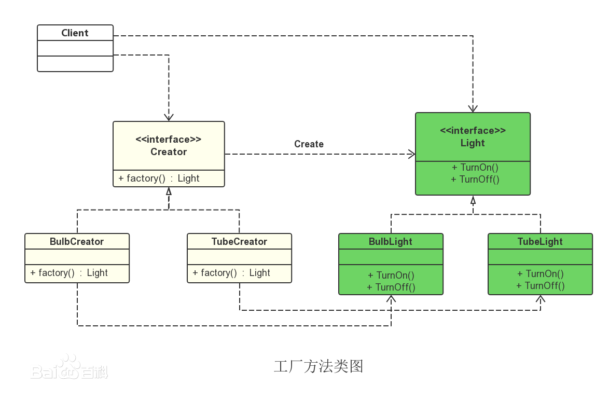

## 工厂方法模式

工厂方法模式，又称工厂模式、多态工厂模式和虚拟构造器模式，通过定义工厂父类负责定义创建对象的公共接口，而子类则负责生成具体的对象。 

工厂方法模式对简单工厂模式进行了抽象。有一个抽象的Factory类（可以是抽象类和接口），这个类将不再负责具体的产品生产，而是只制定一些规范，具体的生产工作由其子类去完成。在这个模式中，工厂类和产品类往往可以依次对应。即一个抽象工厂对应一个抽象产品，一个具体工厂对应一个具体产品，这个具体的工厂就负责生产对应的产品。

### 角色及其职责:

**类图**

**抽象工厂(Creator)角色：**是工厂方法模式的核心，与应用程序无关。任何在模式中创建对象的工厂类必须实现这个接口。

**具体工厂(Concrete Creator)角色：**这是实现抽象工厂接口的具体工厂类，包含与应用程序密切相关的逻辑，并且受到应用程序调用以创建产品对象。在上图中有两个这样的角色：BulbCreator与TubeCreator。

**抽象产品(Product)角色：**工厂方法模式所创建的对象的超类型，也就是产品对象的共同父类或共同拥有的接口。在上图中，这个角色是Light。

**具体产品(Concrete Product)角色：**这个角色实现了抽象产品角色所定义的接口。某具体产品有专门的具体工厂创建，它们之间往往一一对应。

### 优点

1. 符合开-闭原则  

2. 符合单一职责原则 

### 缺点

1. 系统类的个数将成对增加，在一定程度上增加了系统的复杂度

   添加新产品时，除了增加新产品类外，还要提供与之对应的具体工厂类，系统类的个数将成对增加 

2.  一个具体工厂只能创建一种具体产品 

### 工厂方法模式分析

与简单工厂模式相比，具备更好的扩展性，调用方不需要理解具体的产品类及其实例化的过程，也不需要理解具体工厂的实现。

将具体产品的创建和初始化，分别在不同的具体工厂实现，降低了工厂实现的复杂性，提供了更好的解耦以及更好的扩展性。

如果实例化产品类的逻辑较复杂，也会导致工厂类的实现复杂化，但比较与简单工厂，实现方案更加合理。【创建者模式可实现更好的方案】

### 使用场景

- 当一个类不知道它所需要创建的对象的类时 
  在工厂方法模式中，客户端不需要知道具体产品类的类名，只需要知道所对应的工厂即可；
- 当一个类希望通过其子类来指定创建的对象时 
  在工厂方法模式中，对于抽象工厂类只需要提供一个创建产品的接口，而由其子类来确定具体要创建的对象，利用面向对象的多态性和里氏代换原则，在程序运行时，子类对象将覆盖父类对象，从而使得系统更容易扩展。
- 将创建对象的任务委托给多个工厂子类中的某一个，客户端在使用时可以无须关心是哪一个工厂子类创建产品子类，需要时再动态指定。

**工厂方法的使用有以下两种情况:**

第一种情况是对于某个产品，调用者清楚地知道应该使用哪个具体工厂服务，实例化该具体工厂，生产出具体的产品来。

第二种情况，只是需要一种产品，而不想知道也不需要知道究竟是哪个工厂为生产的，即最终选用哪个具体工厂的决定权在生产者一方，它们根据当前系统的情况来实例化一个具体的工厂返回给使用者，而这个决策过程这对于使用者来说是透明的。

### 代码

略