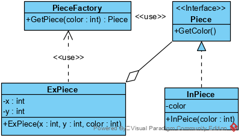

## 享元模式

使用共享物件，用来尽可能减少内存使用量以及分享资讯给尽可能多的相似物件；它适合用于只是因重复而导致使用无法令人接受的大量内存的大量物件。


### 享元模式类结构:

**类图**




### 两个状态

内蕴状态存储在享元内部，不会随环境的改变而有所不同，是可以共享的。如上图，内蕴状态存储在InPiece的color中。

外蕴状态是不可以共享的，它随环境的改变而改变的，因此外蕴状态是由客户端来保持（因为环境的变化是由客户端引起的）。如上图，外蕴状态存储在ExPiece的x，y中。

比如说围棋和跳棋，它们都有大量的棋子对象，围棋和五子棋只有黑白两色，跳棋颜色略多一点，但也是不太变化的，所以棋子颜色就是棋子的内部状态；而各个棋子之间的差别就是位置的不同，我们落子，落子颜色是定的，但位置是变化的，所以方位坐标就是棋子的外部状态。

使用Flyweight模式时，传输、查找和/或计算外部状态都会产生运行时的开销，尤其当f l y w e i g h t原先被存储为内部状态时。然而，空间上的节省抵消了这些开销。共享的f l y w e i g h t越多，空间节省也就越大。


### 优点

大大减少了对象的创建，降低了程序内存的占用，提高效率																																																				

### 缺点

提高了系统的复杂度。需要分离出内部状态和外部状态，而外部状态不可共享，内部状态必须是可共享的。

### 使用场景

- 系统中存在大量相似对象
- 需要缓冲池的场景

Flyweight模式的有效性很大程度上取决于如何使用它以及在何处使用它。当以下情况都成立时使用Flyweight模式：

1. 一个应用程序使用了大量的对象。
2. 完全由于使用大量的对象，造成很大的存储开销。
3. 对象的大多数状态都可变为外部状态。
4. 如果删除对象的外部状态，那么可以用相对较少的共享对象取代很多组对象。
5. 应用程序不依赖于对象标识。

### 代码

享元模式实现代码：

```golang
package flyweight

type Color int

const (
	Black Color = iota
	White
)

var colorStr = []string{"black", "white"}

type Piece interface {
	GetColor() Color
}

type inPiece struct {
	color Color
}

func (ip *inPiece) GetColor() Color {
	return ip.color
}

type PieceFactory interface {
	GetPiece(color Color) Piece
}

//普通工厂，会产生多个piece的实例
type PieceNormalFactory struct {
}

func (pf *PieceNormalFactory) GetPiece(color Color) Piece {
	return &inPiece{
		color: color,
	}
}

//享元工厂，仅产生两个piece的实例
type PieceFWFactory struct {
	pieceSlice []inPiece
}

func (pf *PieceFWFactory) GetPiece(color Color) Piece {
	if pf.pieceSlice == nil {
		pf.pieceSlice = []inPiece{inPiece{
			color: Black,
		}, inPiece{
			color: White,
		}}
	}
	return &pf.pieceSlice[color]
}

type ExPiece struct {
	X, Y  int
	Piece Piece
}

func NewExPiece(x, y int, color Color, factory PieceFactory) *ExPiece {
	ip := factory.GetPiece(color)
	ep := ExPiece{
		X:     x,  //external status
		Y:     y,  //external status
		Piece: ip, //flyweight with internal status "color"
	}
	return &ep
}

```


测试代码：

```golang
package flyweight

import (
	"fmt"
	"math/rand"
	"testing"
)

func TestNormalPiece(t *testing.T) {
	noramlFactory := &PieceNormalFactory{}
	ep := NewExPiece(1, 1, Black, noramlFactory)
	fmt.Printf("x:%d;y:%d,color:%s\n", ep.X, ep.Y, colorStr[ep.Piece.GetColor()])
}
func TestFWPiece(t *testing.T) {
	fwFactory := &PieceFWFactory{}
	ep := NewExPiece(1, 1, Black, fwFactory)
	fmt.Printf("x:%d;y:%d,color:%s\n", ep.X, ep.Y, colorStr[ep.Piece.GetColor()])
}
func TestBatchNormalPiece(t *testing.T) {
	batchCount := 10000
	noramlFactory := &PieceNormalFactory{}
	epMap := make(map[string]struct{})
	for i := 0; i < batchCount; i++ {
		ep := NewExPiece(1, 1, Black, noramlFactory)
		epAddress := fmt.Sprintf("%p", ep.Piece)
		epMap[epAddress] = struct{}{}
		//fmt.Printf("epAddressr:%s\n", epAddress)
	}
	length := len(epMap)
	//fmt.Printf("map length:%d\n", length)

	if length != batchCount {
		t.Fatalf("fail to test flyweight pattern,\nnumber of pieces is %d,expected %d\n", length, batchCount)
	}
}
func TestBatchFWPiece(t *testing.T) {
	fwFactory := &PieceFWFactory{}
	epMap := make(map[string]struct{})
	for i := 0; i < 10000; i++ {
		x := int(rand.Int31n(361))
		y := int(rand.Int31n(361))
		ep := NewExPiece(x, y, Color(i%2), fwFactory)
		epAddress := fmt.Sprintf("%p", ep.Piece)
		epMap[epAddress] = struct{}{}
		//fmt.Printf("epAddressr:%s\n", epAddress)
		//fmt.Printf("x:%d;y:%d,color:%s\n", ep.X, ep.Y, colorStr[ep.Piece.GetColor()])
	}
	length := len(epMap)
	//fmt.Printf("map length:%d\n", length)

	if length != 2 {
		t.Fatalf("fail to test flyweight pattern,\nnumber of pieces is %d,expected 2\n", length)
	}
}

```

TestBatchNormalPiece未实现享元模式，因此，会产生batchCount个piece的实例。

TestBatchFWPiece实现享元模式，因此，仅产生2个piece的实例。

但由于ExPiece需存储外部状态，即不能够共享的x、y，因此，如果统计ExPiece的实例数量，两个测试用例都应该产生batchCount个实例。