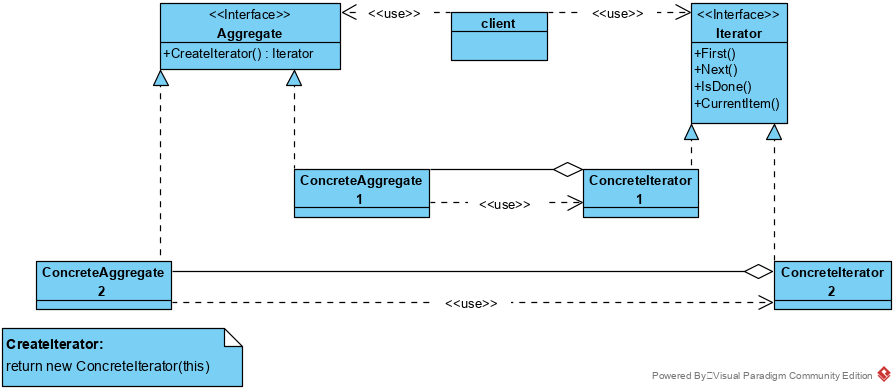

## 迭代器模式

迭代器模式是一种对象行为型模式，提供一个对象来顺序访问聚合对象中的一系列元素，而不暴露聚合对象的内部表示。 

迭代器模式将遍历机制与聚合对象分离，使我们可以定义不同的迭代器来实现不同的遍历策略，而无需再聚合接口中列举它们。

在现实生活以及程序设计中，经常要访问一个聚合对象中的各个元素，如“数据结构 ”中的链表遍历，通常的做法是将链表的创建和遍历都放在同一个类中，但这种方式不利于程序的扩展，如果要更换遍历方法就必须修改程序源代码，这违背了 “开闭原则”。 

既然将遍历方法封装在聚合类中不可取，那么聚合类中不提供遍历方法，将遍历方法由用户自己实现是否可行呢？答案是同样不可取，因为这种方式会存在两个缺点：

1. 暴露了聚合类的内部表示，使其数据不安全；
2.  增加了客户的负担。 

 “迭代器模式”能较好地克服以上缺点，它在客户访问类与聚合类之间插入一个迭代器，这分离了聚合对象与其遍历行为，对客户也隐藏了其内部细节，且满足“单一职责原则”和“开闭原则”，如 Java中的 Collection、List、Set、Map 等都包含了迭代器。 

### 迭代器模式类结构:

**类图**

迭代器模式主要包含以下角色。

1. 抽象聚合（Aggregate）角色：定义存储、添加、删除聚合对象以及创建迭代器对象的接口。
2. 具体聚合（ConcreteAggregate）角色：实现抽象聚合类，返回一个具体迭代器的实例。
3. 抽象迭代器（Iterator）角色：定义访问和遍历聚合元素的接口，通常包含 hasNext()、first()、next() 等方法。
4. 具体迭代器（Concretelterator）角色：实现抽象迭代器接口中所定义的方法，完成对聚合对象的遍历，记录遍历的当前位置。

一般情况下，具体聚合和具体迭代器有较深度的耦合。

此处，创建迭代器【CreateIterator】是一个Factory Method模式的例子。【工厂方法模式】

### 优点

1. 访问一个聚合对象的内容而无须暴露它的内部表示。
2. 遍历任务交由迭代器完成，这简化了聚合类。
3. 它支持以不同方式遍历一个聚合，甚至可以自定义迭代器的子类以支持新的遍历。
4. 增加新的聚合类和迭代器类都很方便，无须修改原有代码。
5. 封装性良好，为遍历不同的聚合结构提供一个统一的接口。

### 缺点

​	增加了类的个数，这在一定程度上增加了系统的复杂性。 

### 迭代器模式分析

迭代器在实现上有许多变化和选择。下面是一些较重要的实现。

1. **谁控制该迭代：**  

   一个基本的问题是决定由哪一方来控制该迭代,是迭代器还是使用该迭代器的客户。当由客户来控制迭代时,该迭代器称为一个外部迭代器(external iterator)，而当由迭代器控制迭代时,该迭代器称为一个内部迭代器(internal iterator)。使用外部迭代器的客户必须主动推进遍历的步伐，显式地向迭代器请求下一个元素。相反地,若使用内部迭代器，客户只需向其提交一个待执行的操作，而迭代器将对聚合中的每一个元素实施该操作。
   外部迭代器比内部迭代器更灵活。例如,若要比较两个集合是否相等，这个功能很容易用外部迭代器实现，而几乎无法用内部迭代器实现。如果语言本身不提供匿名函数、闭包，则内部迭代器的弱点更为明显。但另一方面,内部迭代器的使用较为容易,因为它们已经定义好了迭代逻辑。

2. **谁定义遍历算法:** 

   迭代器不是唯一可定义遍历算法的地方。聚合本身也可以定义遍历算法，并在遍历过程中用迭代器来存储当前迭代的状态。我们称这种迭代器为一个游标(cursor),因为它仅用来指示当前位置。客户会以这个游标为一个参数调用该聚合的Next操作,而Next操作将改变这个指示器的状态。

   如果迭代器负责遍历算法,那么将易于在相同的聚合上使用不同的迭代算法,同时也易于在不同的聚合上重用相同的算法。从另一方面说,遍历算法可能需要访问聚合的私有变量。如果这样，将遍历算法放入迭代器中会破坏聚合的封装性。

3. **迭代器健壮程度:** 

   在遍历一个聚合的同时更改这个聚合可能是危险的。如果在遍历聚合的时候增加或删除该聚合元素,可能会导致两次访问同一个元素或者遗漏掉某个元素。一个简单的解决办法是拷贝该聚合，并对该拷贝实施遍历,但一般来说这样做代价太高。
   一个健壮的迭代器(robust iterator)保证插入和删除操作不会干扰遍历,且不需拷贝该聚合。有许多方法来实现健壮的迭代器。其中大多数需要向这个聚合注册该迭代器。当插入或删除元素时，该聚合要么调整迭代器的内部状态,要么在内部的维护额外的信息以保证正确的遍历。

4. **附加的迭代器操作：**

   代器的最小接口由F i r s t、N e x t、I s D o n e和C u r r e n t I t e m操作组成。其他一些操作可能也很有用。例如,对有序的聚合可用一个P r e v i o u s操作将迭代器定位到前一个元素。

5. **迭代器可有特权访问：**

   迭代器可被看为创建它的聚合的一个扩展。迭代器和聚合紧密耦合。迭代器可能需要访问聚合的内部数据。

6. **空迭代器：**

   一个空迭代器( NullIterator)是一个退化的迭代器,它有助于处理边界条件。根据定义，一个NullIterator总是已经完成了遍历：即,它的IsDone操作总是返回true。

### 使用场景

1. 访问一个聚合对象的内容而无需暴露它的内部表示
2. 支持对聚合对象的多种遍历
3. 为遍历不同的聚合结构提供一个统一的接口

### 代码

略

