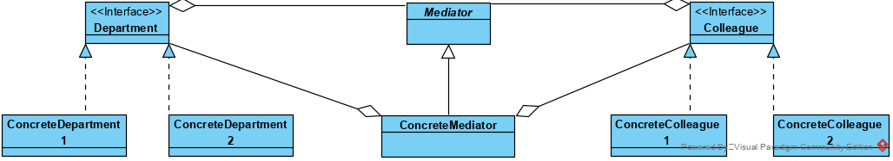

## 中介者模式【调停者】

中介者模式 定义一个中介对象来封装一系列对象之间的交互，使原有对象之间的耦合松散，且可以独立地改变它们之间的交互。中介者模式又叫调停模式，它是迪米特法则的典型应用。 

在 MVC 框架中，控制器（C）就是模型（M）和视图（V）的中介者； 

### 中介者模式类结构:

**类图**

Colleague和Department可以通过持有Mediator的实例，在必要的时候，调用Mediator方法，完成与Department和Colleague的交互；Mediator则可以通过持有的Colleague和Department的实例，实现这一交互。

### 优点

1.  将对象间的多对多关联转变为一对多的关联，提高系统的灵活性，使得系统易于维护和扩展。 
2.  解耦：中介者模式通过把多个同事对象之间的交互封装到调停者对象里面，从而使得同事对象之间松散耦合。
3.  集中控制交互：多个同事对象的交互，被封装在调停者对象里面集中管理，使得这些交互行为发生变化的时候，只需要修改调停者对象就可以了，当然如果是已经做好的系统，那么就扩展调停者对象，而各个同事类不需要做修改。 

​																																																				

### 缺点

1. 如果设计不好，引入中介者会使程序变的复杂
2. 如果需要通过Mediator交互的类较多，可能导致Mediator变得复杂而庞大
3. 如果需要通过Mediator交互的逻辑复杂，也可能导致Mediator变得复杂而庞大 

 Mediator作为一个交互的中枢，如果过度集中化，承担太多的逻辑，会导致系统难以维护。 

### 使用场景

1. 系统中对象之间存在比较复杂的引用关系，导致它们之间的依赖关系结构混乱而且难以复用该对象。 
2. 希望通过一个中间类来封装多个类之间的交互行为。 

### 代码

略

