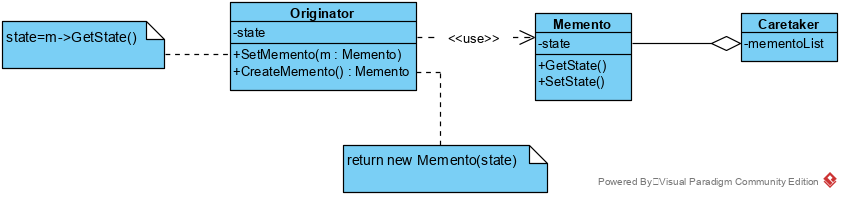

## 备忘录模式

在不破坏封装性的前提下，捕获一个对象的内部状态，并在该对象之外保存这个状态。这样以后就可将该对象恢复到原先保存的状态。 

有时有必要记录一个对象的内部状态。为了允许用户取消不确定的操作或从错误中恢复过来，需要实现检查点和取消机制,而要实现这些机制，你必须事先将状态信息保存在某处，这样才能将对象恢复到它们先前的状态。但是对象通常封装了其部分或所有的状态信息,使得其状态不能被其他对象访问，也就不可能在该对象之外保存其状态。而暴露其内部状态又将违反封装的原则，可能有损应用的可靠性和可扩展性。

### 备忘录模式类图:

**类图**

备忘录模式包含以下主要角色。

1. **Memento(备忘录)**
   —备忘录存储原发器对象的内部状态。原发器根据需要决定备忘录存储原发器的哪些内部状态。
   —防止原发器以外的其他对象访问备忘录。备忘录实际上有两个接口，管理者(caretaker)只能看到备忘录的窄接口—它只能将备忘录传递给其他对象。相反,原发器能够看到一个宽接口,允许它访问返回到先前状态所需的所有数据。理想的情况是只允许生成本备忘录的那个原发器访问本备忘录的内部状态。

2. **Originator(原发器)**
   —原发器创建一个备忘录,用以记录当前时刻它的内部状态。

   —使用备忘录恢复内部状态。

3. **Caretaker(负责人)**

   —负责保存好备忘录。

   —负责获取备忘录的历史纪录

   —不能对备忘录的内容进行操作或检查。

### 优点

1.  提供了一种可以恢复状态的机制。当用户需要时能够比较方便地将数据恢复到某个历史的状态。
2.  实现了内部状态的封装。除了创建它的发起人之外，其他对象都不能够访问这些状态信息。
3.  简化了发起人类。发起人不需要管理和保存其内部状态的各个备份，所有状态信息都保存在备忘录中，并由管理者进行管理，这符合单一职责原则。

### 缺点

 资源消耗大。如果要保存的内部状态信息过多或者特别频繁，将会占用比较大的内存资源。 

### 备忘录模式实现效果分析：

1. **保持封装边界**

   使用备忘录可以避免暴露一些只应由原发器管理却又必须存储在原发器之外的信息。该模式把可能很复杂的Originator内部信息对其他对象屏蔽起来,从而保持了封装边界。

2. **简化了原发器**

   在其他的保持封装性的设计中, Originator负责保持客户请求过的内部状态版本。这就把所有存储管理的重任交给了Originator。让客户管理它们请求的状态将会简化Originator,并且使得客户工作结束时无需通知原发器。

3. **使用备忘录可能代价很高**

   如果原发器在生成备忘录时必须拷贝并存储大量的信息,或者客户非常频繁地创建备忘录和恢复原发器状态，可能会导致非常大的开销。除非封装和恢复Originator状态的开销不大,否则该模式可能并不合适。可以考虑增量式改变的实现方案。

4. **定义窄接口和宽接口**

   在一些语言中可能难以保证只有原发器可访问备忘录的状态。

5. **维护备忘录的潜在代价**

   管理器负责维护备忘录。然而,管理器不知道备忘录中有多少个状态。因此当存储备忘录时，一个本来很小的管理器，可能会产生大量的存储开销。

### 使用场景

1.   必须保存一个对象在某一个时刻的(部分)状态,这样以后需要时它才能恢复到先前的状态。 
2.  如果一个用接口来让其它对象直接得到这些状态，将会暴露对象的实现细节并破坏对象的封装性。 

### 代码

略
