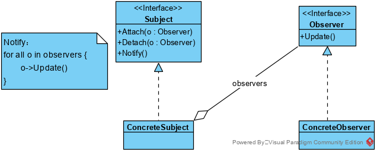
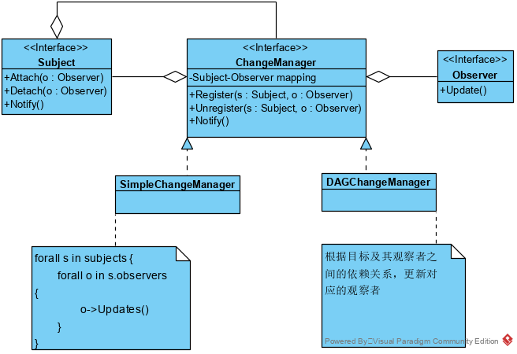

## 观察者模式

 观察者模式定义一系列对象之间的一对多关系，当一个对象改变、更新状态时，依赖它的都会收到通知改变或者更新。  

### 观察者模式类结构:

**类图**

通过调用Subject的Attach，将参数Observer加入到Subject的观察者列表，Observer即成为Subject的观察者的一员；当Subject发生改变时，则会通知链表中的所有观察者，调用观察者的Update，完成相应的业务逻辑。

### 优点

1.  降低了目标与观察者之间的耦合关系，两者之间是抽象耦合关系。 
2.  目标与观察者之间建立了一套触发机制。  

### 缺点

1. 如果一个被观察者对象有很多的直接和间接的观察者的话，将所有的观察者都通知到会花费很多时间。

2. 如果在观察者和观察目标之间有循环依赖的话，观察目标会触发它们之间进行循环调用，可能导致系统崩溃。

3. 观察者模式没有相应的机制让观察者知道所观察的目标对象是怎么发生变化的，而仅仅只是知道观察目标发生了变化。 

4.  一个观察者的卡顿会影响整体的执行效率。 可考虑并发的方式解决，但对代码的要求显著提高。

### 观察者模式分析

1. **目标和观察者间的抽象耦合:**  

   一个目标所知道的仅仅是它有一系列观察者,每个都符合抽象的Observer类的简单接口。目标不知道任何一个观察者属于哪一个具体的类。这样目标和观察者之间的耦合是抽象的和最小的。
   因为目标和观察者不是紧密耦合的,它们可以属于一个系统中的不同抽象层次。一个处于较低层次的目标对象可与一个处于较高层次的观察者通信并通知它,这样就保持了系统层次的完整。如果目标和观察者混在一块,那么得到的对象要么横贯两个层次(违反了层次性),要么必须放在这两层的某一层中(这可能会损害层次抽象)。

2. **支持广播通信:** 

   不像通常的请求,目标发送的通知不需指定它的接收者。通知被自动广播给所有已向该目标对象登记的有关对象。目标对象并不关心到底有多少对象对自己感兴趣;它唯一的责任就是通知它的各观察者。这给了你在任何时刻增加和删除观察者的自由。处理还是忽略一个通知取决于观察者。

3. **意外的更新:** 

   因为一个观察者并不知道其它观察者的存在,它可能对改变目标的最终代价一无所知。在目标上一个看似无害的的操作可能会引起一系列对观察者以及依赖于这些观察者的那些对象的更新。此外,如果依赖准则的定义或维护不当，常常会引起错误的更新,这种错误通常很难捕捉。
   简单的更新协议不提供具体细节说明目标中什么被改变了,这就使得上述问题更加严重。如果没有其他协议帮助观察者发现什么发生了改变，它们可能会被迫尽力减少改变。

### 观察者模式实现依赖机制相关的问题
1. **创建目标到其观察者之间的映射**

   一个目标对象跟踪它应通知的观察者的最简单的方法是显式地在目标中保存对它们的引用。然而,当目标很多而观察者较少时,这样存储可能代价太高。一个解决办法是用时间换空间,用一个关联查找机制(例如一个hash表)来维护目标到观察者的映射。这样一个没有观察者的目标就不产生存储开销。但另一方面,这一方法增加了访问观察者的开销。

2. **观察多个目标**

   在某些情况下,一个观察者依赖于多个目标可能是有意义的。例如,一个表格对象可能依赖于多个数据源。在这种情况下,必须扩展Update接口以使观察者知道是哪一个目标送来的通知。目标对象可以简单地将自己作为Update操作的一个参数,让观察者知道应去检查哪一个目标。

3. **谁触发更新**

   目标和它的观察者依赖于通知机制来保持一致。但到底哪一个对象调用Notify来触发更新?此时有两个选择:
   a)由目标对象的状态设定操作在改变目标对象的状态后自动调用Notify。这种方法的优点是客户不需要记住要在目标对象上调用Notify，缺点是多个连续的操作会产生多次连续的更新,可能效率较低。
   b)让客户负责在适当的时候调用Notify。这样做的优点是客户可以在一系列的状态改变完成后再一次性地触发更新,避免了不必要的中间更新。缺点是给客户增加了触发更新的责任。由于客户可能会忘记调用Notify，这种方式较易出错。

4. **对已删除目标的悬挂引用**

   删除一个目标时应注意不要在其观察者中遗留对该目标的悬挂引用。一种避免悬挂引用的方法是,当一个目标被删除时，让它通知它的观察者将对该目标的引用复位。一般来说,不能简单地删除观察者,因为其他的对象可能会引用它们,或者也可能它们还在观察其他的目标。

5. **在发出通知前确保目标的状态自身是一致的**

   在发出通知前确保状态自身一致这一点很重要,因为观察者在更新其状态的过程中需要查询目标的当前状态。

6. **避免特定于观察者的更新协议—推/拉模型**

   观察者模式的实现经常需要让目标广播关于其改变的其他一些信息。目标将这些信息作为Update操作一个参数传递出去。这些信息的量可能很小，也可能很大。
   一个极端情况是，目标向观察者发送关于改变的详细信息,而不管它们需要与否。我们称之为推模型(push model)。另一个极端是拉模型(pull model);目标除最小通知外什么也不送出,而在此之后由观察者显式地向目标询问细节。
   拉模型强调的是目标不知道它的观察者,而推模型假定目标知道一些观察者的需要的信息。推模型可能使得观察者相对难以复用，因为目标对观察者的假定可能并不总是正确的。另一方面。拉模型可能效率较差,因为观察者对象需在没有目标对象帮助的情况下确定什么改变了。

7. **显式地指定感兴趣的改变**

   你可以扩展目标的注册接口,让各观察者注册为仅对特定事件感兴趣，以提高更新的效率。当一个事件发生时,目标仅通知那些已注册为对该事件感兴趣的观察者。支持这种做法一种途径是，对使用目标对象的方面（aspects）的概念。[在attach时，增加额外的信息，表示当前观察者感兴趣的方面]

8. **封装复杂的更新语义**

   当目标和观察者间的依赖关系特别复杂时,可能需要一个维护这些关系的对象。我们称这样的对象为更改管理器（ChangeManager）。它的目的是尽量减少观察者反映其目标的状态变化所需的工作量。例如,如果一个操作涉及到对几个相互依赖的目标进行改动,就必须保证仅在所有的目标都已更改完毕后，才一次性地通知它们的观察者,而不是每个目标都通知观察者。
   ChangeManager有三个责任:
   a) 它将一个目标映射到它的观察者并提供一个接口来维护这个映射。这就不需要由目标来维护对其观察者的引用,反之亦然。
   b) 它定义一个特定的更新策略。
   c) 根据一个目标的请求,它更新所有依赖于这个目标的观察者。
   下图描述了一个简单的基于ChangeManager的Observer模式的实现。有两种特殊的ChangeManager。SimpleChangeManager总是更新每一个目标的所有观察者,比较简单。相反,DAGChangeManager处理目标及其观察者之间依赖关系构成的无环有向图。当一个观察者观察多个目标时, DAGChangeManager要比SimpleChangeManager更好一些。在这种情况下,两个或更多个目标中产生的改变可能会产生冗余的更新。DAGChangeManager保证观察者仅接收一个更新。当然，当不存在多重更新的问题时,SimpleChangeManager更好一些。
   ChangeManager是一个Mediator 模式的实例。通常只有一个ChangeManager,并且它是全局可见的。这里Singleton模式可能有用。

**ChangeManager类图**

### 使用场景

1. 当一个抽象模型有两个方面，其中一个方面依赖于另一方面。将这二者封装在独立的对象中以使它们可以各自独立地改变和复用。

2. 当对一个对象的改变需要同时改变其他对象，而不知道具体有多少对象需要被改变。

3. 当一个对象必须通知其他对象，而它又不能假定其他对象是谁。换言之，不希望这些对象是紧密耦合的。

   观察者模式非常适合实现消息通知、事件处理等。

### Xts中的应用

X2ts中的总线bus采用了简化的观察者模式。Event可看作是subject，Bus可看作ChangeManager，通过Bus->on函数注册的callback函数，可看作observer，dispatch可看作nofity函数。

### 代码

略

