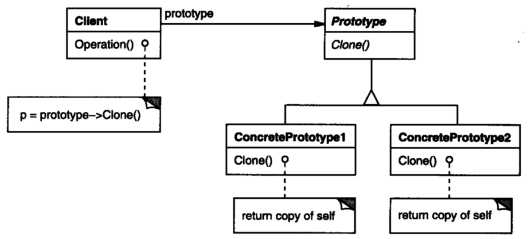

## 原型模式

用**原型实例**指定创建对象的种类，并且通过拷贝这些原型创建新的对象。

这种模式是实现了一个原型接口，该接口用于创建当前对象的克隆。当直接创建对象的代价比较大时，则采用这种模式。例如，一个对象需要在一个高代价的数据库操作之后被创建。我们可以缓存该对象，在下一个请求时返回它的克隆，在需要的时候更新数据库，以此来减少数据库调用。

### 原型模式类图

**类图**

### 优点

1. 性能提高。 

2. 逃避构造函数的约束。 

   当创建新的对象实例较为复杂时，使用原型模式可以简化对象的创建过程，通过一个已有实例可以提高新实例的创建效率。

3. 运行时刻增加和删除产品

   Prototype允许只通过客户注册原型实例就可以将一个新的具体产品类加入系统。它比其他创建型模式更为灵活，因为客户可以在运行时刻建立和删除原型。

4. 改变值以指定新对象

   高度动态的系统允许你通过对象复合定义新的行为—例如，通过为一个对象变量指定值—并且不定义新的类。通过实例化已有类并且将这些实例注册为客户对象的原型，就可以有效定义新类别的对象。客户可以将职责代理给原型，从而表现出新的行为。
   这种设计使得用户无需编程即可定义新“类”。实际上，克隆一个原型类似于实例化一个类。Prototype模式可以极大的减少系统所需要的类的数目。

5. 改变结构以指定新对象。

   许多应用由部件和子部件来创建对象。部件对象将Clone实现为一个深拷贝，即可通过改变部件与子部件的结构来生成新的对象。

6. 减少子类的构造

   工厂方法模式经常产生一个与产品类层次平行的Creator类层次。Prototype模式使得你克隆一个原型而不是请求一个工厂方法去产生一个新的对象。因此你根本不需要Creator类层次。

7. 

### 缺点

1. 配备克隆方法需要对类的功能进行通盘考虑，这对于全新的类不是很难，但对于已有的类不一定很容易，特别当一个类引用不支持串行化的间接对象，或者引用含有循环结构的时候。 
2. 在实现深克隆时需要编写较为复杂的代码。

### 原型模式分析

由于创建对象比较复杂、耗时，如需要访问网络或数据库获取数据，在创建完成后，将对象缓存；业务系统需要创建时，则直接调用已创建对象的克隆方法，获取与已创建的对象相同的对象。

某种意义上，原型模式相当于针对某些高代价的操作，提供了缓存机制，以减少创建对象时的开销。

与工厂模式相比，原型模式仅通过克隆操作创建对象，在某些场景下，原型模式可以提高创建对象的性能[以空间换时间]

原型模式与工厂模式结合起来，可实现更强大的方案。

局限性：严格的原型模式提供克隆操作，也就是说创建的是当前对象的一个copy，因此，其仅适用于完全的对象复制。但在实际应用当中，可以考虑部分缓存克隆，其他部分根据逻辑初始化，以提高适用场景。

### 使用场景

1.  资源优化场景。 

   类初始化需要消化非常多的资源，这个资源包括数据、硬件资源等。 

2. 性能和安全要求的场景。 

   通过 new 产生一个对象需要非常繁琐的数据准备或访问权限，则可以使用原型模式。 

3. 一个对象多个修改者的场景。

   一个对象需要提供给其他对象访问，而且各个调用者可能都需要修改其值时，可以考虑使用原型模式拷贝多个对象供调用者使用。

4. 当一个系统应该独立于它的产品创建、构成和表示时，要使用Prototype模式 

   例如：在不知道类名，但当前持有一个类的实例的情况下，需要再创建这个类的实例。

5. 当要实例化的类是在运行时刻指定时，例如，通过动态装载

6. 为了避免创建一个与产品类层次平行的工厂类层次

7. 当一个类的实例只能有几个不同状态组合中的一种时。建立相应数目的原型并克隆它们可能比每次用合适的状态手工实例化该类更方便一些。

 在实际项目中，原型模式很少单独出现，一般是和工厂方法模式一起出现，通过 clone 的方法创建一个对象，然后由工厂方法提供给调用者。

### 代码

略

### 参考

https://blog.csdn.net/qq_34337272/article/details/80706444