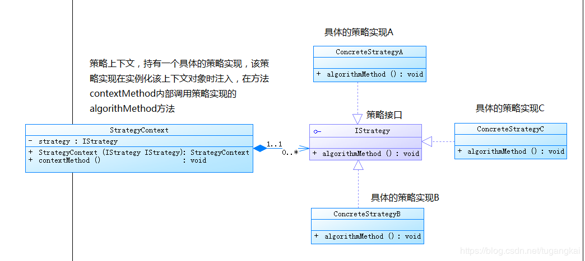

## 策略模式

定义一系列的算法,把它们一个个封装起来,并且使它们可相互替换。本模式使得算法可独立于使用它的客户而变化。 

策略模式提供了可以替换继承关系的办法。继承可以处理多种算法或行为。如果不是用策略模式，那么使用算法或行为的环境类就可能会有一些子类，每一个子类提供一个不同的算法或行为。但是，这样一来算法或行为的使用者就和算法或行为本身混在一起。决定使用哪一种算法或采取哪一种行为的逻辑就和算法或行为的逻辑混合在一起，从而不可能再独立演化。继承使得动态改变算法或行为变得不可能。 

例如：

1. 人，多种出行方式，如果采用继承，定义多种人，也可实现功能，但设计非常的怪异。自行车人，汽车人，走路人。

2. 店铺，多种打折方式，以及多种付款方式，如果采用继承实现，则需要更多奇怪的类。甚至，付款方式，必须在付款前才能确定，即必须动态绑定，不能采用继承这种静态扩展方式。

   如果有两个以上维度的行为上的区别，则排列组合，会产生非常多的类。

策略模式，就是面向接口设计的一种应用方式，**接口及具体实现类**定义的不是具体的产品或者“类”，而是一些可变的行为及行为所需的数据。

### 策略模式:

**类图**

### 优点

1.  算法可以自由切换。
2.  避免使用多重条件判断。 
3.  扩展性良好。
4.  使类的可变行为部分分离出来，降低了单个类的复杂度。
5. 算法使用客户不应该知道的数据。可使用策略模式以避免暴露复杂的、与算法相关的数据结构。

### 缺点

  1. 策略类会增多。

     策略模式造成很多的策略类，每个具体策略类都会产生一个新类。有时候可以通过把依赖于环境的状态保存到客户端里面，而将策略类设计成可共享的，这样策略类实例可以被不同客户端使用。换言之，可以使用享元模式来减少对象的数量。 

  2. 所有策略类都需要对外暴露。 

     客户端必须知道所有的策略类，并自行决定使用哪一个策略类。这就意味着客户端必须理解这些算法的区别，以便适时选择恰当的算法类。换言之，策略模式只适用于客户端知道所有的算法或行为的情况。 

### 使用场景

1.  多个类只区别在表现行为不同，可以使用Strategy模式，在运行时动态选择具体要执行的行为 。
2.  一个系统需要动态地在几种算法中选择一种。 
3.  如果一个对象有很多的行为，如果不用恰当的模式，这些行为就只好使用多重的条件选择语句来实现。 

### 代码

略

### 其他

状态模式的类图和策略模式类似，并且都是能够动态改变对象的行为。但是状态模式是通过状态转移来改变 Context 所组合的 State 对象，而策略模式是通过 Context 本身的决策来改变组合的 Strategy 对象。所谓的状态转移，是指 Context 在运行过程中由于一些条件发生改变而使得 State 对象发生改变，注意必须要是在运行过程中。

状态模式主要是用来解决状态转移的问题，当状态发生转移了，那么 Context 对象就会改变它的行为；而策略模式主要是用来封装一组可以互相替代的算法族，并且可以根据需要动态地去替换 Context 使用的算法。