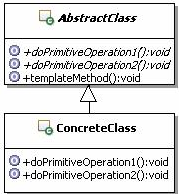

## 模板方法模式

 https://www.cnblogs.com/wangkaihua/p/9123171.html 

定义一个操作中的算法的骨架，而将一些步骤延迟到子类中。模板方法使得子类可以不改变一个算法的结构即可重定义该算法的某些特定步骤。 

### 模板方法类结构:

**类图**

- **AbstractClass：**抽象类。用来定义算法骨架和原语操作，在这个类里面，还可以提供算法中通用的实现
- **ConcreteClass：**具体实现类。用来实现算法骨架中的某些步骤，完成跟特定子类相关的功能。

### 优点

1. 一次性实现一个算法的不变的部分，并将可变的行为留给子类来实现。
2. 各子类中公共的行为应被提取出来并集中到一个公共父类中以避免代码重复。
3. 控制子类扩展。模板方法只在特定点调用“hook”操作，这样就只允许在这些点进行扩展。

### 缺点

​	增加了类的个数，这在一定程度上增加了系统的复杂性。 

### 模板方法模式分析

 模板方法的功能在于固定算法骨架，而让具体算法实现可扩展。这在实际应用中非常广泛，尤其是在设计框架级功能的时候非常有用。框架定义好了算法的步骤，在合适的点让开发人员进行扩展，实现具体的算法。 

 模板方法模式需要固定定义算法的骨架，这个骨架应该使共用的，算是一个公共的行为，但是里面具体的步骤的实现又可能是各不相同的，符合选择抽象类的原则。把模板实现成为抽象类，为所有的子类提供了公共的功能，就是定义了具体的算法骨架；同时在模板里面把需要由子类扩展的具体步骤的算法定义成为抽象方法，要求子类去实现这些方法，这就约束了子类的行为。因此综合考虑，用抽象类来实现模板是一个很好的选择。 

模板方法导致一种反向的控制结构，这种结构有时被称为“好莱坞法则”，即“别找我们，我们找你”。这指的是一个父类调用一个子类的操作，而不是相反。按照通常的思路，是子类找父类才对，也就是应该是子类来调用父类的方法，因为父类根本就不知道子类，而子类是了解父类的，但是在模板方法模式里面，父类通过定义原语操作和算法骨架，来调用子类原语操作的具体实现，实现反向的控制结构。 

回调函数也可以实现类似的功能，即定义好算法骨架后，通过传入“函数”作为骨架的参数，实现重定义该算法的某些特定步骤。与模板方法模式相比，其具有更好的灵活性，但破坏了面向对象的封装特性，如果系统较大、较复杂，不利于理解，而模板方法，代码结构更加的清晰明了。

### 使用场景

1. 多个子类有公有的方法，并且逻辑基本相同时；
2. 重要，复杂的算法，可以把核心算法设计为模板方法，周边的相关细节功能则由各个子类实现；
3. 重构时，模板方法模式 是一个经常使用的模式，把相同的代码抽取到父类，然后通过钩子函数约束其行为；

### 代码

略

