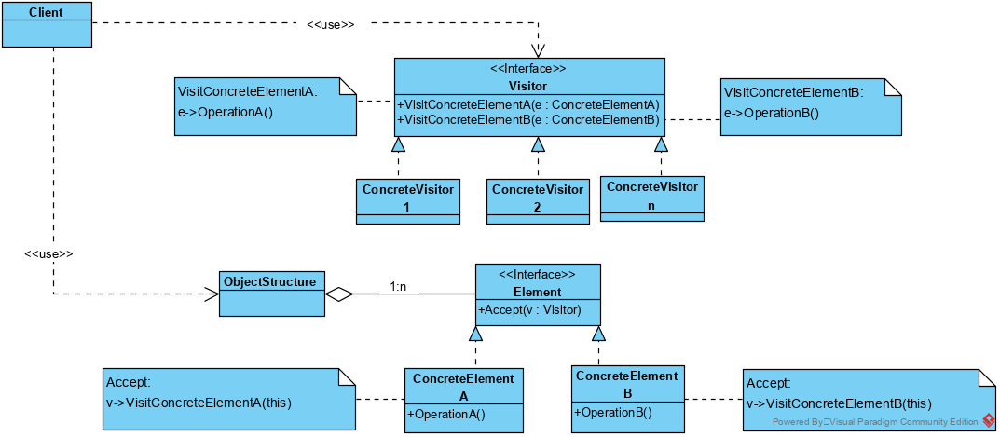
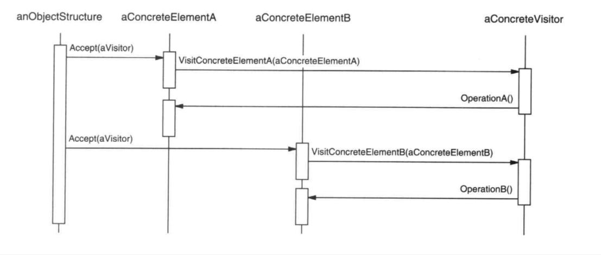

## 访问者模式

 https://www.jianshu.com/p/1f1049d0a0f4 

访问者模式是一种将数据操作和数据结构分离的设计模式。 访问者表示一个作用于某对象结构中的各元素的操作。

它使你可以在不改变各元素的类的前提下定义作用于这些元素的新操作，将访问操作独立出来变成一个新的类 ，当我们需要增加访问操作的时候，直接增加新的类，原来的代码不需要任何的改变。

例如：编译器进行语法检查，非常的复杂，可以将各种检查操作，封装为独立访问者，如“类型检查”、“代码优化”、“流程分析”等，都可以封装为独立的访问者，简化了整个语法检查的实现，程序结构更加合理，更加有利于理解。

如果我们需要增加“变量是否在使用前被赋初值”检查，访问者模式只需要增加一个访问者，不会影响语法检查的主程序和其他的访问者。

访问者的操作大多要求对不同的元素进行不同的处理。因此访问者与具体的元素一般是紧密耦合的，即访问者的操作会访问到具体的元素的

使用Visitor模式，必须定义两个类层次：一个对应于接受操作的元素；另一个对应于定义对元素的操作的访问者。

元素的种类应该固定不变，而访问者可以方便的扩展。

### 访问者模式类图

**类图**

**时序**

访问者模式包含以下主要角色。

1. **Visitor：**

   接口或者抽象类，定义了对每个具体Element类访问的行为，它的参数就是被访问的元素，它的方法个数理论上与元素具体类的个数是一样的。因此，访问者模式要求元素的类型要稳定，如果经常添加、移除元素类，必然会导致频繁地修改 Visitor 接口及其具体实现类，如果出现这种情况，则说明不适合使用访问者模式。访问者可以确定正被访问元素的具体的类。这样访问者就可以通过该元素的特定接口直接访问它。

2. **ConcreteVisitor：**

   具体的访问者，它需要给出对每一个元素类访问时所产生的具体行为。

3. **Element：**

   元素接口或者抽象类，它定义了一个接受访问者（accept）的方法，其意义是指每一个元素都要可以被访问者访问。

4. **ConcreteElementA、ConcreteElementB：**

   具体的元素类，它提供接受访问的具体实现，而这个具体的实现，通常情况下是调用访问者提供的访问该元素类的方法。

5. **ObjectStructure：**

   定义当中所提到的对象结构，对象结构是一个抽象表述，它内部管理了元素集合，并且可以迭代这些元素提供访问者访问。

### 优点

1.  **各角色职责分离，符合单一职责原则**
    Visitor、ConcreteVisitor、Element 、ObjectStructure，职责单一，各司其责。
2.  **具有优秀的扩展性**
    如果需要增加新的访问者，增加实现类 ConcreteVisitor 就可以快速扩展。
3.  **使得数据结构和作用于结构上的操作解耦，使得操作集合可以独立变化**
    Visitor剥离了需在ObjectStructure中实现的复杂繁多的操作逻辑，使程序结构更合理。
4.  **灵活性**

### 缺点

1. **具体元素对访问者公布细节，违反了迪米特原则**
   具体的Visitor需要理解ObjectStructure的具体结构[Element]和element的具体结构。
2. **具体元素变更时导致修改成本大**
   如果增加element类，则visitor及其具体实现都需要相应更改。
3. **违反了依赖倒置原则，为了达到“区别对待”而依赖了具体类，没有依赖抽象**
   访问者 visit*方法中，依赖了具体element的具体方法。

### 访问者模式实现效果分析：

1. **访问者模式使得易于增加新的操作**

   访问者使得增加依赖于复杂对象结构的构件的操作变得容易了。仅需增加一个新的访问者即可在一个对象结构上定义一个新的操作。相反，如果每个功能都分散在多个类之上的话，定义新的操作时必须修改每一类。

2. **访问者集中相关的操作而分离无关的操作**

   相关的行为不是分布在定义该对象结构的各个类上，而是集中在一个访问者中。无关行为却被分别放在它们各自的访问者子类中。这就既简化了这些元素的类，也简化了在这些访问者中定义的算法。所有与它的算法相关的数据结构都可以被隐藏在访问者中。

3. **增加新的ConcreteElement类很困难**

   Visitor模式使得难以增加新的Element的子类。每添加一个新的ConcreteElement都要在Vistor中添加一个新的抽象操作，并在每一个ConcreteVisitor类中实现相应的操作。有时可以在Visitor中提供一个缺省的实现，这一实现可以被大多数的ConcreteVisitor继承，但这与其说是一个规律还不如说是一种例外。
   所以在应用访问者模式时考虑关键的问题是系统的哪个部分会经常变化，是作用于对象结构上的算法呢还是构成该结构的各个对象的类。如果老是有新的ConcretElement类加入进来的话，Vistor类层次将变得难以维护。在这种情况下，直接在构成该结构的类中定义这些操作可能更容易一些。如果Element类层次是稳定的，而你不断地增加操作获修改算法，访问者模式可以帮助你管理这些改动。

4. **累积状态**

   当访问者访问对象结构中的每一个元素时，它可能会累积状态。如果没有访问者，这一状态将作为额外的参数传递给进行遍历的操作，或者定义为全局变量。例如：对当前元素的操作，需依赖上一个元素的操作结果，则可以用visitor来存储这个结果。

5. **破坏封装**

   访问者方法假定ConcreteElement接口的功能足够强，足以让访问者进行它们的工作。结果是，该模式常常迫使你提供访问元素内部状态的公共操作，这可能会破坏它的封装性。

### 使用场景

1.  对象结构比较稳定，但经常需要在此对象结构上定义新的操作。
2.  需要对一个对象结构中的对象进行很多不同的并且不相关的操作，而需要避免这些操作“污染”这些对象的类，也不希望在增加新操作时修改这些类。

### 代码

略
